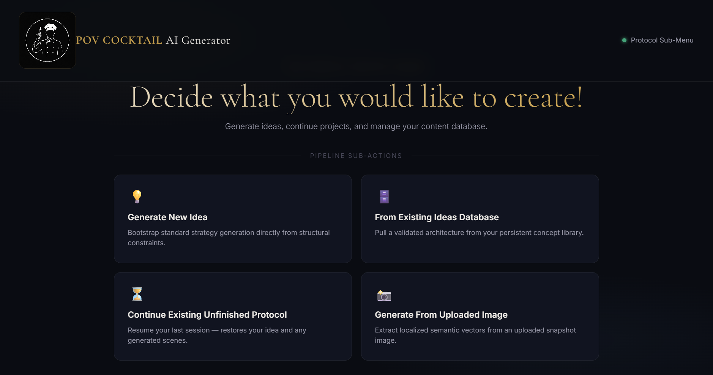
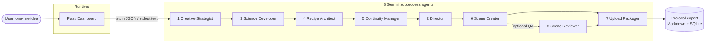

# POV Cocktail Video Generator

[](https://github.com/KHOUB-ENG/pov-cocktail-video-generator/actions/workflows/ci.yml)
[](LICENSE)
[](https://www.python.org/)

A **multi-agent LLM orchestration pipeline** that turns a one-line brief into a complete,
structured production package for a short-form video — concept, science, recipe, storyboard,
shot-by-shot prompts, and an upload package — through a chain of eight specialised Google
Gemini agents behind a single Flask dashboard.

The demo domain is a faceless YouTube Shorts cocktail channel ("POV Cocktail"), but the
interesting part is the architecture: **eight sequential agents, each an isolated
stdin-JSON / stdout-text subprocess**, with retry/backoff, live progress streaming, job
cancellation, per-agent generation tuning, and resumable session state.

> One **Protocol = one short-form video.** The pipeline produces the science brief, the full
> recipe, a continuity spec, a director storyboard, a shot-by-shot scene breakdown (with
> ready-to-paste **Ideogram** still prompts and **Kling** image-to-video prompts + voiceover
> lines), and a YouTube upload package (titles, description, pinned comments, checklist).

> 

## Architecture



Each agent is launched as a subprocess by a single `_run_agent()` helper. Agents receive a
JSON blob on stdin, call Gemini with a dedicated system prompt (see `prompts/`), and print
their result to stdout. The retrying Gemini client (`agents/agent_progress.py`) makes three
attempts with backoff and emits `@@PROGRESS@@` events on stderr for live UI updates.

## Quick start

```bash
# 1. Install dependencies
pip install -r requirements.txt

# 2. Configure your API key
cp .env.example .env        # then edit .env and paste your Google Gemini key

# 3. Create the local SQLite database
python src/database/create_database.py

# 4. (Optional) Load demo data so the dashboard starts with a sample library
python src/database/seed_demo_data.py

# 5. Run the dashboard
python src/orchestrator/main.py
```

Step 4 seeds a handful of fictional "previously published" Protocols plus a few
in-progress ideas, so the dashboard has content to show on first run.

Then open <http://localhost:5000> in your browser.

Get a Gemini API key at <https://aistudio.google.com/apikey>. The active model is set in
`src/config/geminiAPIsettings.py` (`GEMINI_MODEL`, currently `gemini-2.5-flash`).

## The eight agents

| # | Agent | Produces |
|---|-------|----------|
| 1 | Creative Strategist | Up to 9 concept ideas (title + cocktail) |
| 3 | Science Developer | Science / technique brief |
| 4 | Recipe Architect | Full production recipe |
| 5 | Continuity Manager | Visual blocks, props JSON, vessel state machine |
| 2 | Director | Storyboard (phases, pacing, hero moment) |
| 6 | Scene Creator | Shot-by-shot Ideogram + Kling + voiceover prompts |
| 8 | Scene Reviewer | *(optional)* QA pass that audits & fixes the scene breakdown |
| 7 | Upload Packager | YouTube titles, description, comments, checklist |

Agents are numbered by their original design order; the UI runs them in the order shown
above (science/recipe/continuity are generated before the director storyboard).

### Per-agent generation tuning

Output variance is controlled from a single place — `AGENT_TEMPERATURES` in
`src/config/geminiAPIsettings.py`. Idea/story agents run hot (~0.85) for creativity;
rule-following agents that must copy prop names and stamps verbatim run cold (~0.3) for
obedience. `agent_progress.py` looks up each agent's temperature by its label and passes a
`GenerateContentConfig` into every Gemini call.

## Repository layout

```
src/
  orchestrator/   main.py (Flask app + orchestrator) + pov_cocktail_dashboard.html (single-page UI)
  agents/         agent1..agent8 + agent_progress.py (retrying Gemini call)
  config/         geminiAPIsettings.py (model, API key, per-agent temperatures)
  database/       thin SQLite wrappers (videos, working_ideas, potential_future_ideas)
prompts/          one .md system prompt per agent — the real "brains" of the project
protocols/        exported Protocol .md archives (a sample is included)
data/             local SQLite DB + live session state (git-ignored; created at runtime)
docs/             architecture notes
tests/            pytest suite for the idea-parsing logic
```

## Testing

```bash
pip install pytest
pytest
```

The suite pins the behaviour of `parse_ideas_from_response` — the five-strategy parser that
turns free-form model output into structured idea records. CI runs it on Python 3.11 and
3.12 (see `.github/workflows/ci.yml`).

## Scope & roadmap

The pipeline currently outputs **text prompts**. Generating the clips (Ideogram/Kling),
rendering the voiceover, and assembling the final cut (CapCut) are done manually. The main
area for future work is closing that gap — wiring the image/video/TTS generation APIs
directly into the pipeline so a Protocol renders end to end.

## Notes for contributors

- The prompts in `prompts/` are where output quality is won or lost. Treat them as the
  primary source, not the Python.
- Agents never touch SQLite directly — always go through `src/database/`.
- See `ARCHITECTURE.md` for detailed architecture and conventions.

## License

MIT — see [LICENSE](LICENSE).
